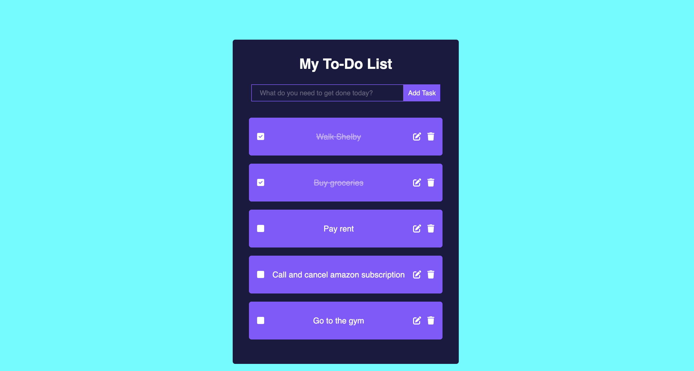

# ToDo App

## Project Description

The ToDo App is a simple React application that allows users to manage their to-do list. Users can add, edit, and delete tasks in the list.

## How to setup

Run the following commands to setup, given `npm` is available:

1. git clone git@github.com:shaunjiji/ToDoApp.git
2. cd ToDoApp
3. npm install
4. npm run start

## Running tests

To run the tests run `npm run test` from the project root.

## Libraries/Tools used

1. uuid: Used this library for generating and working with UUIDs (Universally Unique Identifiers).
2. jest and ts-jest: Used Jest testing libraries for running tests.
3. typescript: Used TypeScript compiler, which allows you to write statically typed JavaScript code.
4. @mui/material: Used the Material-UI library to implement pre-built React components.
5. @fortawesome: Font awesome libraries for adding customizable icons.

## Future Enhancements

This was a coding challenge and scope is quite small. If it was a bigger real project, I would add the following features:

1. Task Prioritization: Allow users to assign priorities to tasks, such as high, medium, or low priority, to organize their to-dos effectively.
2. Task Categories or Tags: Allow users to categorize tasks with tags or labels to group related tasks together.
3. Filtering: Allow users to filter tasks based on specific attributes.
4. Due Dates: Allow users to set due dates or deadlines for tasks.
5. Saving Tasks to Local Storage: Use localStorage object in JavaScript to save tasks.
